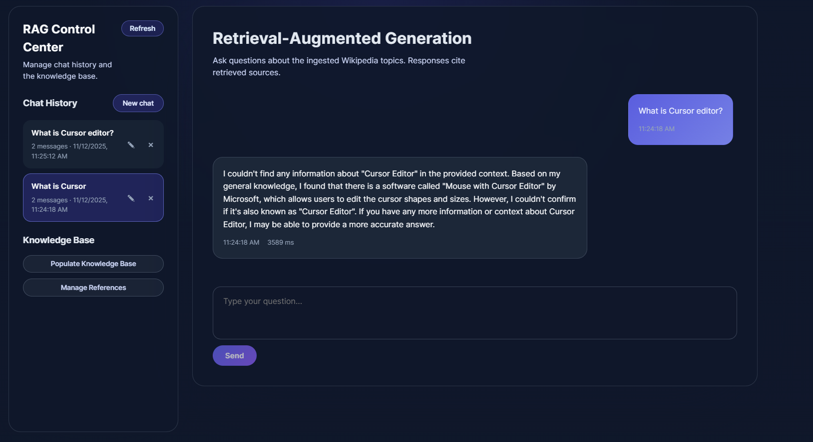
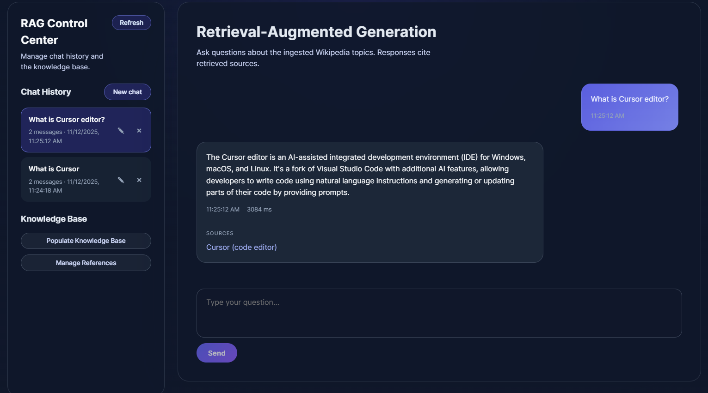
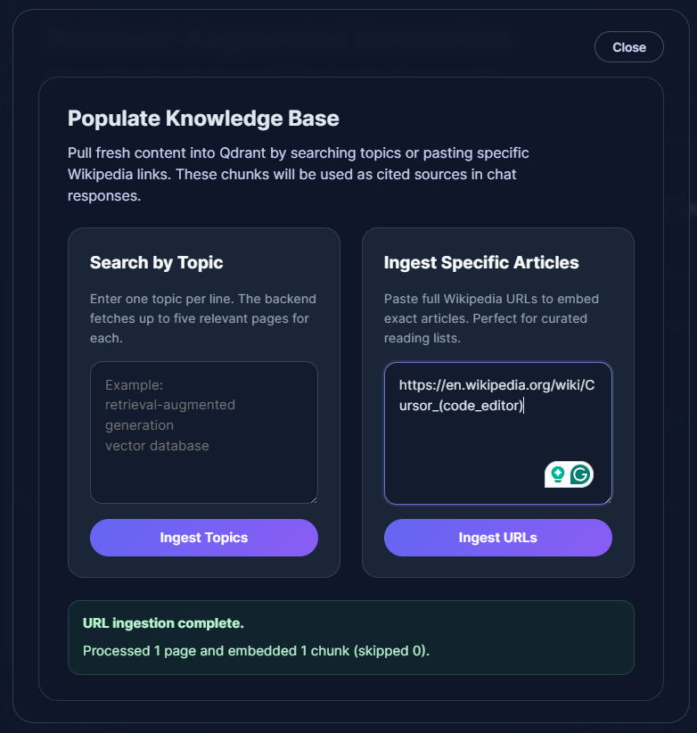
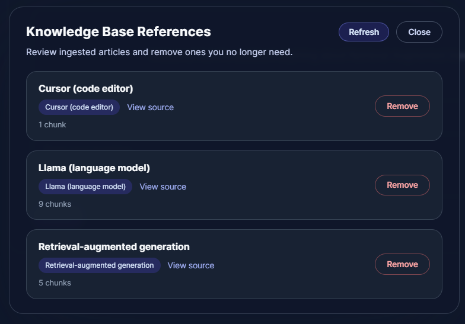

# Retrieval-Augmented Generation Chat Application ✨

A project demonstrating RAG capabilities using **Ollama** and **Wikipedia** as the knowledge base. This application shows how you can "finetune" any AI to **YOUR actual needs** without expensive model training. Simply feed your AI with your own knowledge base, company documents, internal wikis, product specifications, or any domain-specific content.

**The best part?** This architecture is easily applicable to other LLM models (GPT, Claude, etc.) and can work with your personal data sources beyond Wikipedia. The AI answers questions using your actual data, with full citation and source transparency.

---

## Why RAG?

Traditional AI models are trained on general knowledge and may not have access to your company's specific information, internal processes, or proprietary data. **Retrieval-Augmented Generation (RAG)** solves this by:

**No Model Training Required** - Use any pre-trained LLM (like Llama, GPT, Claude, etc.) without expensive fine-tuning  
**Real-Time Knowledge Updates** - Add new information instantly without retraining models  
**Source Transparency** - Every answer includes citations, so you know exactly where the information came from  
**Domain-Specific Expertise** - Transform generic AI into a specialist for your company's needs  
**Cost-Effective** - Significantly cheaper than training custom models while achieving similar results

### RAG in Action: Context Makes the Difference 🎯

See the dramatic difference RAG makes when answering questions. The comparison below shows how context transforms generic AI responses into accurate, cited answers.

#### Without Context (Standard AI)



#### With RAG Context (Enhanced AI)



**Without RAG**, the AI relies solely on its training data, which can lead to:
- Generic or outdated information
- No access to company-specific processes or documents
- Inability to cite sources
- Potential hallucinations when asked about proprietary information

**With RAG**, the AI:
- **Retrieves relevant chunks** 🔍 from your knowledge base using semantic search
- **Synthesizes answers** 🧠 using both the retrieved context and its general knowledge
- **Provides citations** 📖 linking back to the original sources
- **Stays current** ⚡ with your latest documents and information
- **Answers accurately** ✅ about your company's specific content

The difference is clear: RAG-powered responses are grounded in your actual data, making the AI a reliable assistant for your organization's needs.

### Knowledge Base Management 📚

Build and manage your knowledge base with ease. The interface below shows both ingestion and management capabilities side by side.

<table>
<tr>
<td width="50%">

**Populate Your Knowledge Base**



</td>
<td width="50%">

**Manage Your References**



</td>
</tr>
</table>

#### Populate Your Knowledge Base 🎨

Easily add content to your knowledge base through two methods:

1. **Search by Topic** - Enter topics (one per line), and the system automatically fetches up to five relevant Wikipedia pages for each topic. Perfect for quickly building a knowledge base around specific subjects.

2. **Ingest Specific Articles** - Paste full Wikipedia URLs to embed exact articles. Ideal for curated reading lists or when you need precise control over the content.

The ingestion process:
- Fetches content from Wikipedia
- Splits documents into semantic chunks
- Generates vector embeddings for each chunk
- Stores everything in Qdrant vector database for fast retrieval

#### Manage Your References 🗂️

Full transparency and control over your knowledge base:

- **View All Ingested Content** 👀 - See every article, document, or reference in your knowledge base
- **Monitor Chunk Counts** 📊 - Understand how your content is structured and indexed
- **Remove Outdated Content** 🗑️ - Delete references that are no longer relevant
- **Track Sources** 🔗 - Each reference shows title, topic, URL, and chunk count

This management interface ensures your knowledge base stays clean, relevant, and up-to-date with your company's evolving needs.

### Key Features ✨

- **Semantic Search** 🔎 - Find relevant information using vector similarity search
- **Multi-Session Chat** 💬 - Manage multiple conversation threads
- **Source Citations** 📝 - Every answer includes clickable source links
- **Wikipedia Integration** 🌐 - Easy ingestion of Wikipedia content (easily extensible to other sources)
- **Real-Time Updates** ⚡ - Add or remove knowledge without downtime
- **Modern UI** 🎨 - Clean, responsive React interface
- **RESTful API** 🔌 - Full FastAPI backend with OpenAPI documentation

---

## Setup & Installation

### Prerequisites

Before you begin, ensure you have the following installed:

- **Python 3.11+** 🐍 (with pip)
- **Node.js 18+** 📦 and **npm**
- **Docker Desktop** 🐳 (for Qdrant and MongoDB)
- **Ollama** 🤖 (for running local LLM models)

### Quick Start

The easiest way to get started is using our automated startup scripts:

#### Windows (PowerShell - Recommended)

```powershell
.\scripts\start.ps1
```

#### Windows (Command Prompt)

```cmd
scripts\start.bat
```

These scripts will:
1. Check if Docker is running ✅
2. Start Qdrant vector database container (port 6333) 🗄️
3. Start MongoDB container (port 27017) 🍃
4. Launch FastAPI backend server (port 8000) 🚀
5. Launch React frontend dev server (port 5173) ⚛️

To stop all services:

```powershell
.\scripts\stop.ps1
```

or

```cmd
scripts\stop.bat
```

### Manual Setup 🔧

If you prefer to set up manually or need more control:

#### 1. Backend Setup

```bash
# Navigate to backend directory
cd backend

# Create and activate virtual environment (using conda as example)
conda create -n RAG python=3.11
conda activate RAG

# Install Python dependencies
pip install -r requirements.txt
```

#### 2. Frontend Setup

```bash
# Navigate to web directory
cd web

# Install Node.js dependencies
npm install
```

#### 3. Docker Services

Start Qdrant and MongoDB using Docker:

```bash
# Start Qdrant vector database
docker run -d \
  --name qdrant-rag \
  -p 6333:6333 \
  -p 6334:6334 \
  -v $(pwd)/qdrant_storage:/qdrant/storage \
  qdrant/qdrant

# Start MongoDB
docker run -d \
  --name mongo-rag \
  -p 27017:27017 \
  -v $(pwd)/mongo_data:/data/db \
  mongo:latest
```

#### 4. Environment Configuration

Create a `.env` file in the `backend/` directory (optional, defaults are provided):

```env
# MongoDB Configuration
MONGODB_URI=mongodb://localhost:27017
MONGODB_DATABASE=rag_portfolio

# Qdrant Configuration
QDRANT_URL=http://localhost:6333
COLLECTION_NAME=wiki_rag

# Embedding Model
EMBED_MODEL=sentence-transformers/bge-small-en-v1.5
VECTOR_SIZE=384

# Ollama Configuration
OLLAMA_HOST=http://localhost:11434
OLLAMA_MODEL=llama3.2:3b

# Optional: Retriever threshold
RETRIEVER_SCORE_THRESHOLD=0.5
```

#### 5. Start Ollama

Make sure Ollama is installed and running with your chosen model:

```bash
# Install Ollama from https://ollama.ai
# Pull the model
ollama pull llama3.2:3b

# Start Ollama server (usually runs automatically)
```

#### 6. Run the Application

**Backend:**
```bash
cd backend
uvicorn app.main:app --reload --host 0.0.0.0 --port 8000
```

**Frontend:**
```bash
cd web
npm run dev
```

### Access Points 🌐

Once everything is running, you can access:

- **Frontend UI** 🖥️: http://localhost:5173
- **Backend API** 🔌: http://localhost:8000
- **API Documentation** 📖: http://localhost:8000/docs
- **Qdrant Dashboard** 📊: http://localhost:6333/dashboard
- **MongoDB** 🍃: mongodb://localhost:27017

### Project Structure 📁

```
Retrieval-Augmented-Generation/
├── backend/                 # FastAPI backend
│   ├── app/
│   │   ├── core/           # Settings and configuration
│   │   ├── db/             # Database clients (MongoDB, Qdrant)
│   │   ├── embeddings/     # Embedding model management
│   │   ├── models/         # Pydantic models
│   │   ├── routers/        # API route handlers
│   │   └── services/       # Business logic services
│   └── requirements.txt    # Python dependencies
├── web/                     # React frontend
│   ├── src/
│   │   ├── api/            # API client
│   │   ├── components/     # React components
│   │   └── ...
│   └── package.json        # Node.js dependencies
├── scripts/                 # Startup/shutdown scripts
├── demo/                    # Demo screenshots
└── README.md               # This file
```

